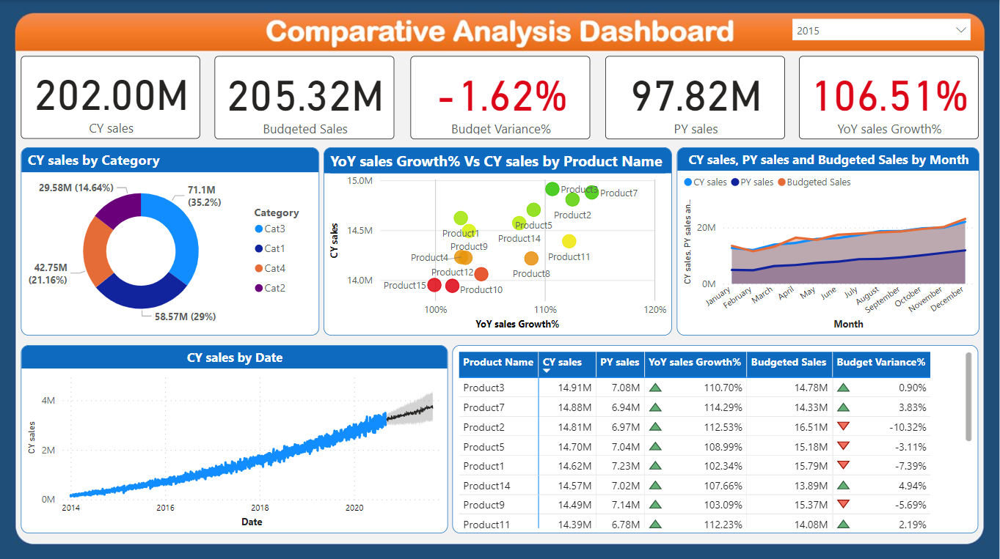

<body>
    <h1> Comparative Analysis Dashboard </h1>
    <h2>Technical Highlights:</h2>
    <ol>
        <li>Developed a dynamic Power BI dashboard for comprehensive comparative analysis 🚀</li>
        <li>Applied advanced conditional formatting techniques to highlight key insights 📊</li>
        <li>Utilized DAX functions to calculate and visualize budget variance and YoY growth % 🔢</li>
        <li>Employed effective data modeling strategies for optimized data representation 📈</li>
        <li>Designed and implemented an intuitive tooltip feature for enhanced user engagement 💡</li>
    </ol>
    <h2>Business Impact:</h2>
    <ol>
        <li>Provided actionable insights through data-driven analysis of budget variance and YoY growth % 📈</li>
        <li>Empowered decision-making by presenting complex data in an easily understandable format 📊</li>
        <li>Enhanced user experience through interactive visualizations and user-friendly tooltips 🌐</li>
        <li>Demonstrated expertise in harnessing data for informed business strategies 📊</li>
        <li>Showcased the potential of data analytics in driving insightful business outcomes 🚀</li>
    </ol>
    <h2>Skills:</h2>
    
Business Intelligence (BI) · Microsoft Power BI

    <h2>Dashboard Preview:</h2>
    
</body>
</html>
